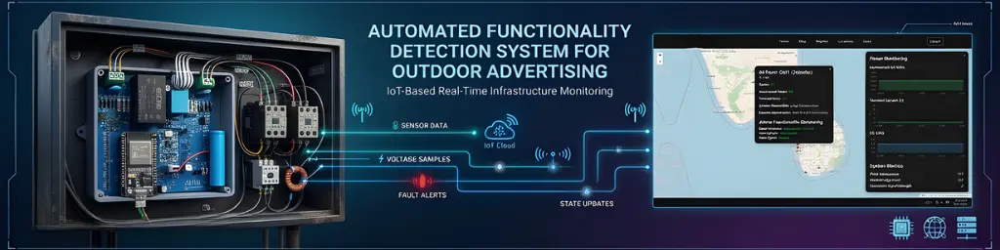
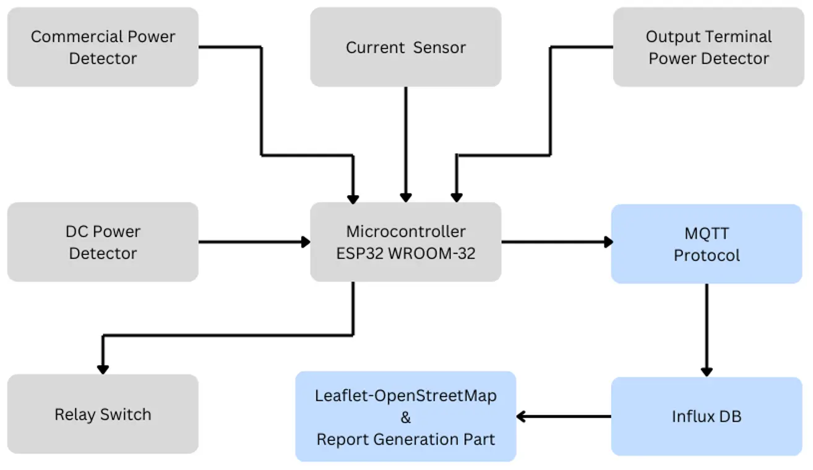
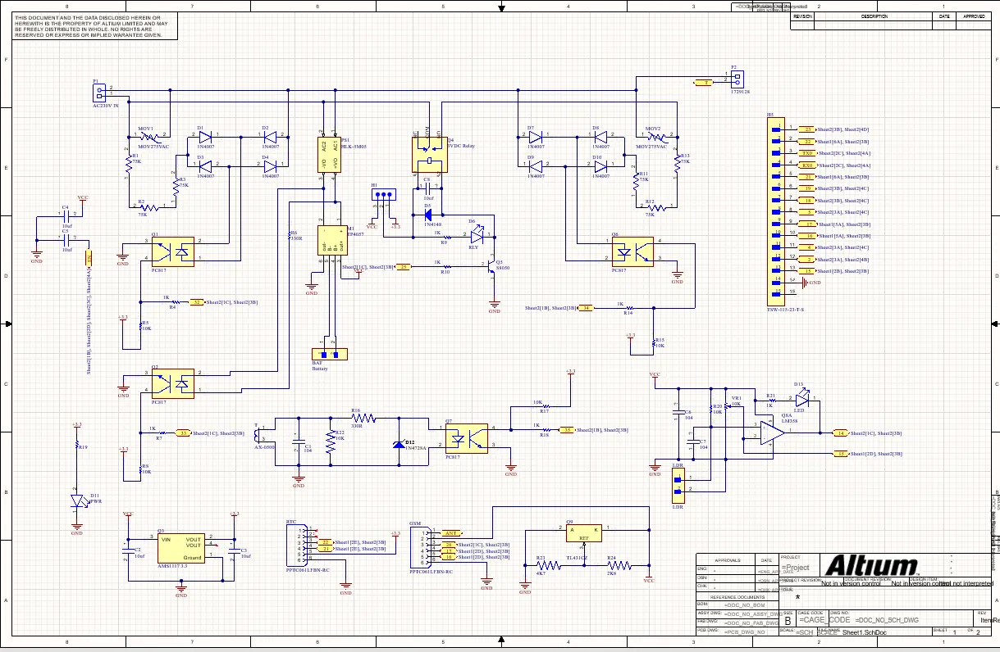
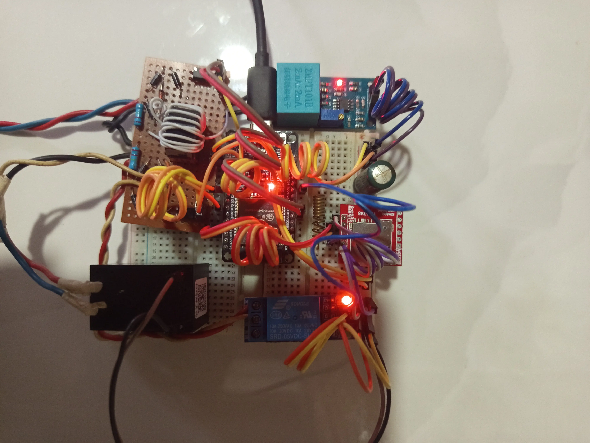
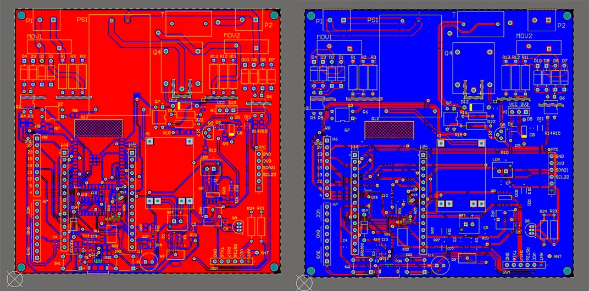
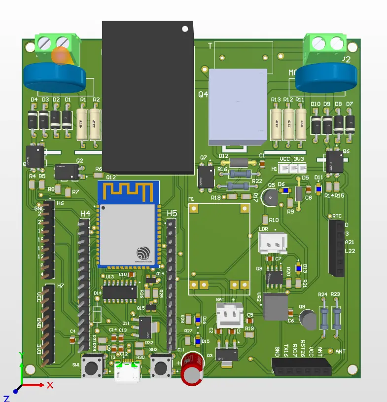
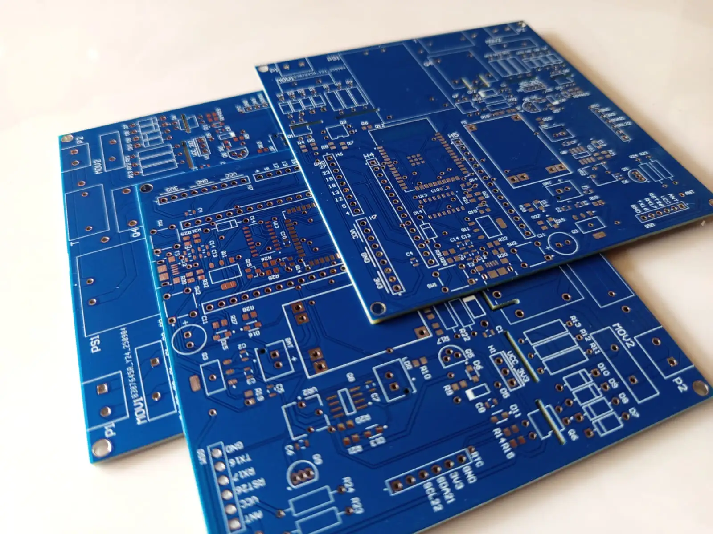
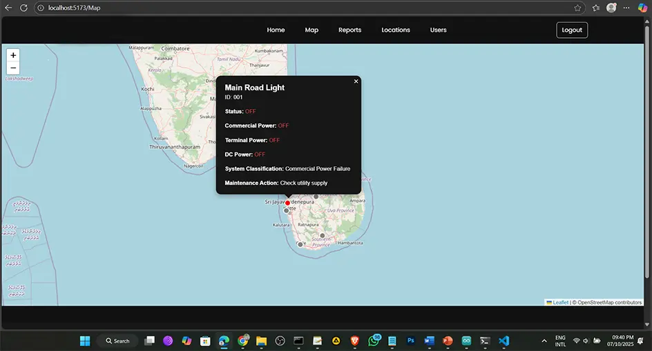
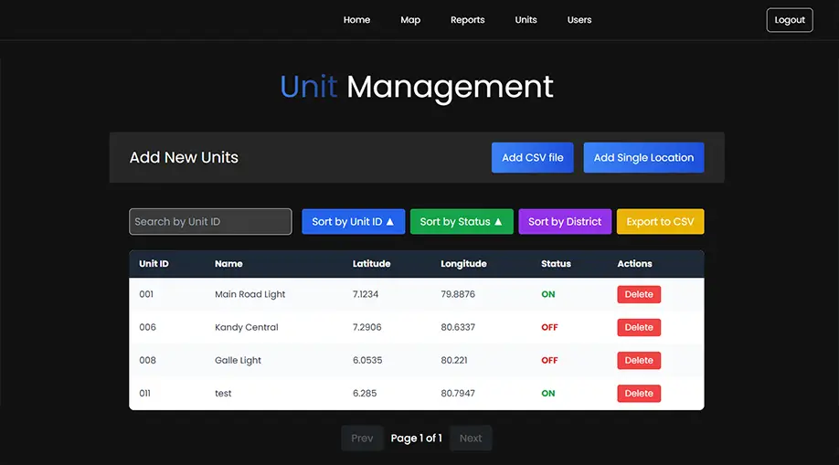

  

<h1 align="center">
Automated Functionality Detection System for Outdoor Advertising
</h1>

An IoT-based monitoring system designed to detect power and operational faults in outdoor advertising panels in real time.

---

# Project Overview

Outdoor advertising installations such as LED panels and billboards often suffer from operational failures including power outages, power supply faults, and switching circuit failures.

This project introduces an **IoT-based automated monitoring system** that continuously monitors the operational status of outdoor advertising panels and detects different types of faults in real time.

The system automatically transmits operational data to a **cloud-based monitoring platform**, enabling remote supervision and rapid fault detection.

This project was developed as part of **Industrial Training under the Department of Electronics, Wayamba University of Sri Lanka**.

---

# Complete Monitoring System

The final system consists of a monitoring unit installed on outdoor LED advertising panels with an IoT dashboard for real-time monitoring and fault detection.

---

# System Architecture

The system architecture integrates sensing circuits, microcontroller processing, wireless communication, and a cloud monitoring dashboard.

### Hardware Components

- ESP32 WROOM-32 Microcontroller
- Current Transformer Sensors
- PC817 Optocouplers
- Power Monitoring Circuits
- Relay Switching Interface

### Software Components

- MQTT Communication
- Telegraf Data Processing
- InfluxDB Time-Series Database
- React.js Monitoring Dashboard

---

# Mechanical Design (SolidWorks)

The mechanical structure was designed using **SolidWorks** to create a **custom enclosure for the electronic control unit and PCB**. The enclosure protects the internal components from environmental conditions and provides a compact mounting solution for the sensors, communication modules, and power system.

### Key Mechanical Features

- Custom enclosure for electronic PCB modules    
- Protection for internal electronics  
- Compact and durable design for field deployment

---

# Circuit Design

## Circuit Diagram

The electronic system is based on the **ESP32 WROOM-32 microcontroller**, designed to monitor electrical parameters and control switching operations.

The circuit integrates sensor interfaces, signal isolation, and power monitoring modules to ensure reliable data acquisition and safe system operation.

### Main Circuit Blocks

- ESP32 WROOM-32 Microcontroller
- Current Transformer (CT) Sensors
- PC817 Optocoupler Isolation Circuits
- Power Monitoring and Signal Conditioning Circuits
- Relay Switching Interface

---

## Breadboard Prototype

Initial testing of the electronic system was performed using a **breadboard prototype** to validate sensor readings, microcontroller communication, and power monitoring functionality before designing the PCB.

---

# PCB Layout Design

The electronic system was implemented using **custom-designed PCBs** to integrate the microcontroller, sensor interfaces, and switching circuits into a compact and reliable hardware platform.

## Panelized PCB Layout (Top & Bottom)

This image shows the **combined PCB layout including both top and bottom layers**, prepared for manufacturing.

---

## PCB Prototype

Prototype PCBs were assembled to verify circuit functionality, signal isolation, and sensor interface operation.

---

## Fabricated PCB

The final PCBs were fabricated using **FR4 double-layer boards**, providing durability, improved signal integrity, and reliable long-term operation.

---

# Web Monitoring Dashboard

## System Monitoring Dashboard

The system includes a **web-based monitoring dashboard** that displays the real-time status of all advertising billboard units deployed in the field.

The dashboard visualizes the operational condition of each unit through an **interactive map interface built using the Leaflet open-source mapping library**. Each advertising unit is represented as a map marker that indicates the current system status and operational classification.

Maintenance teams can quickly identify faulty units and perform required maintenance actions based on the map visualization.

### Dashboard Features

- Real-time monitoring of advertising billboard units  
- Interactive map visualization using **Leaflet Open Source Map**  
- System classification and status indication  
- Maintenance monitoring and fault identification  
- Remote monitoring through web interface  

---

## Advertising Unit Management

The system also includes an **Advertising Unit Management panel** that allows administrators to manage billboard units in the system.

Through this interface, users can **add, edit, remove, and organize advertising units** that appear on the monitoring map.

Units can be added either manually through the interface or by **importing CSV data files**, making it easy to register a large number of billboard locations.

### Management Features

- Add new advertising units  
- Edit existing unit information  
- Remove or deactivate units  
- Bulk unit registration using **CSV file upload**  
- Manual unit entry through the dashboard interface  

---

# Live System Demo

The web monitoring dashboard can be accessed here:

🔗 **Live Demo**  
https://wqc-web.web.app

---

# Project Report

You can download the full research report here:

📄 **Download Final Report**  
[Download Report](Documents/FinalReport.pdf)

---

# Key Features

- Real-time monitoring of outdoor LED advertising panels  
- Automatic power failure detection
- Interactive map visualization 
- System classification and status indication  
- Maintenance monitoring and fault identification  
- Output switching fault detection  
- IoT-based remote monitoring system  
- Cloud data storage and visualization  
- Scalable architecture for large deployments  

---

# Technologies Used

### Hardware

- ESP32 WROOM-32
- Current Transformer Sensors
- PC817 Optocouplers

### Software

- Arduino IDE
- MQTT
- Telegraf
- InfluxDB
- React.js

### Design Tools

- Altium Designer
- SolidWorks

---

# Academic Information

**University**  
Wayamba University of Sri Lanka

**Degree Program**  
B.Sc. (Joint Major) – Electronics and Computing & Information Systems

**Project Type**  
Final Year Undergraduate Research Project

**Research Presentation**  
Presented at **ASRITE Research Symposium**

**Project Supervisor**  
Eng. 

---

# Author

**Tharusha Sangeeth**

Electronics & Embedded Systems Developer  
Wayamba University of Sri Lanka

---
